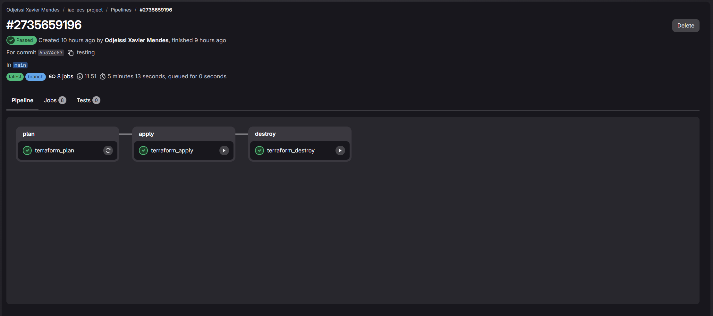
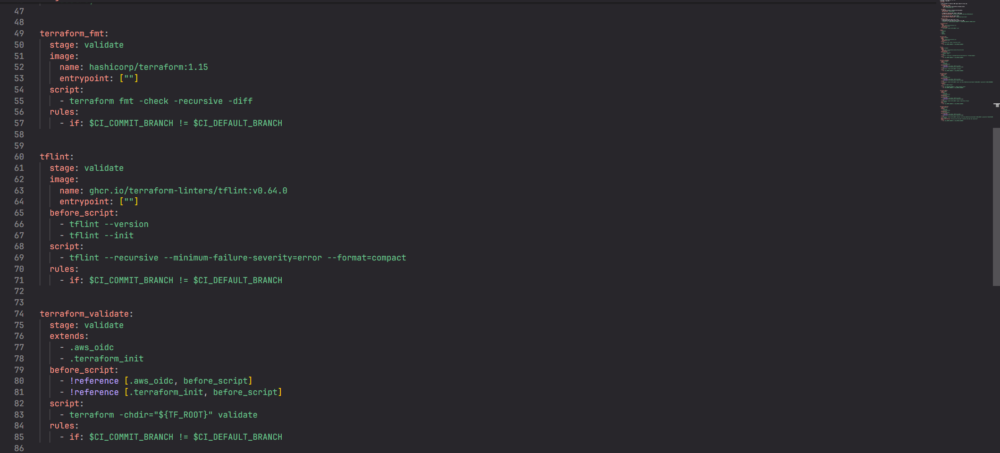
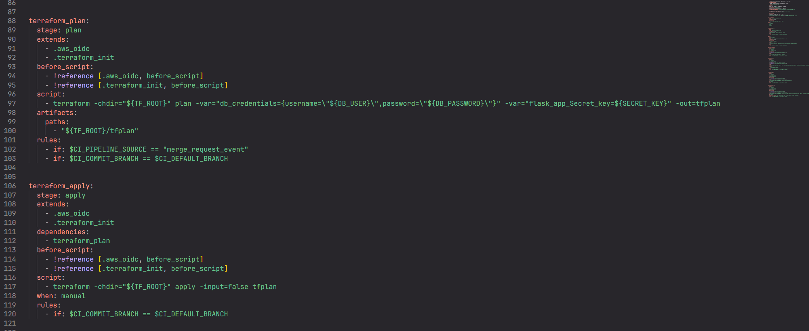
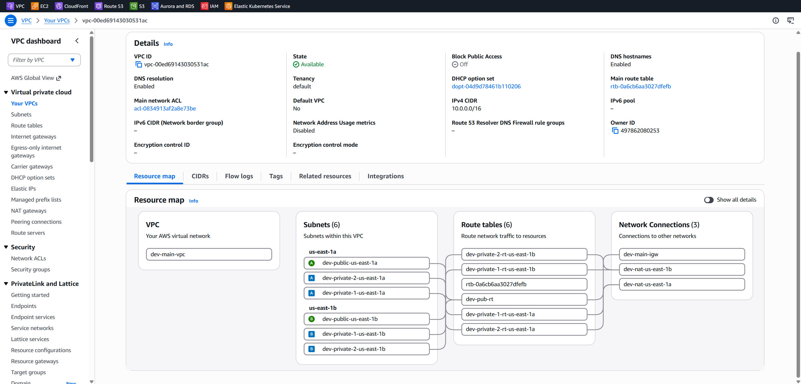
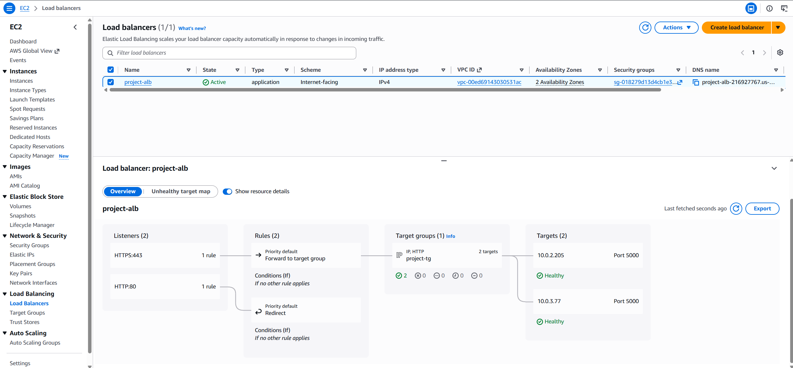
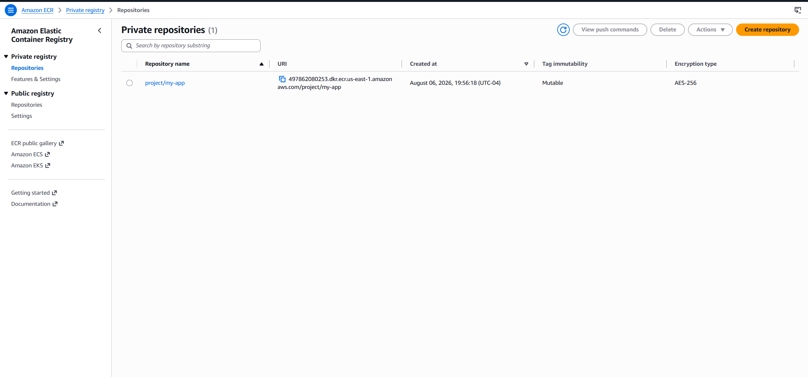
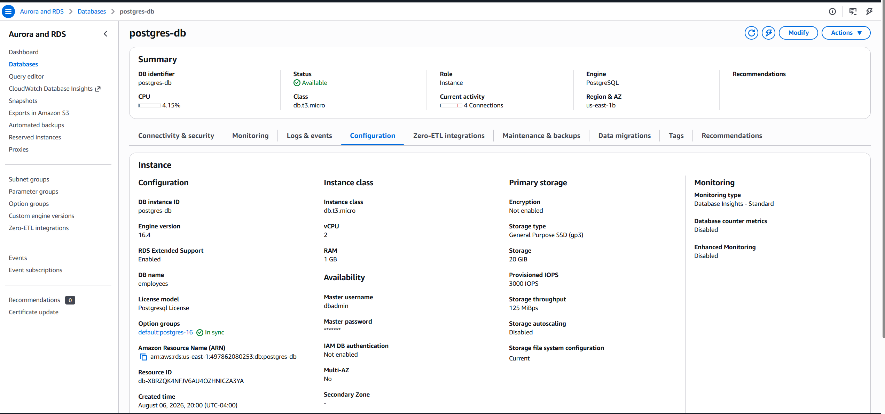
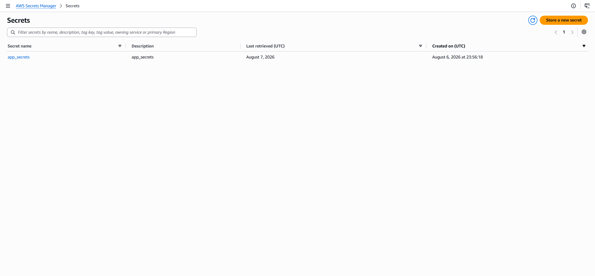
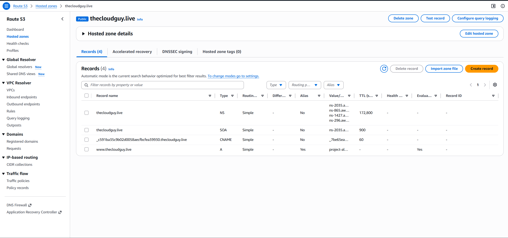
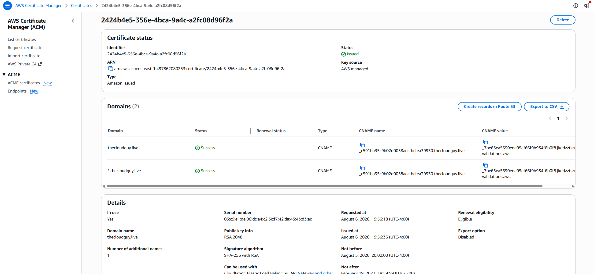

# AWS 3-Tier Containerized Infrastructure with Terraform and GitLab CI/CD

## Project Overview

This project builds a 3-tier AWS environment using Terraform.

The application runs in containers on Amazon ECS, and GitLab CI/CD is used to validate and deploy the infrastructure.

I organized the Terraform code into modules so each part of the infrastructure is easier to manage and reuse.

For authentication, GitLab connects to AWS using OIDC. This lets the pipeline assume an IAM role and use temporary credentials instead of storing AWS access keys in GitLab.

---

## Table of Contents

- [Architecture](#architecture)
- [Infrastructure Design](#infrastructure-design)
- [AWS Services Used](#aws-services-used)
- [Tools and Technologies](#tools-and-technologies)
- [Project Goals](#project-goals)
- [Repository Structure](#repository-structure)
- [Terraform Modules](#terraform-modules)
- [Application Traffic Flow](#application-traffic-flow)
- [Secrets Management](#secrets-management)
- [GitLab CI/CD Pipeline](#gitlab-cicd-pipeline)
- [GitLab OIDC Authentication](#gitlab-oidc-authentication)
- [Screenshots](#screenshots)
- [Skills Used](#skills-used)

---

## Architecture

The project uses a 3-tier design:

1. **Entry Layer** - Route 53, ACM, and the Application Load Balancer handle incoming HTTPS traffic.
2. **Application Layer** - The application runs on Amazon ECS inside private subnets.
3. **Database Layer** - Amazon RDS runs in separate private database subnets.

The Docker image is stored in Amazon ECR.

Application and database secrets are stored in AWS Secrets Manager.

### Architecture Flow

```text
                         Internet
                            |
                            v
                        Route 53
                            |
                            v
                     Application Load
                        Balancer
                       HTTPS / ACM
                            |
                            v
                  +-------------------+
                  |    ECS Service    |
                  |   Private Subnets |
                  +-------------------+
                            |
                            v
                  +-------------------+
                  |        RDS        |
                  |   Private Subnets |
                  +-------------------+

ECR --------------------> ECS Tasks

Secrets Manager ---------> ECS Tasks
```

---

## Infrastructure Design

The AWS environment is split between public and private subnets.

- The VPC contains all of the project resources.
- Public subnets are used by the Application Load Balancer.
- Private application subnets are used by ECS tasks.
- Private database subnets are used by Amazon RDS.
- Security groups control traffic between the ALB, ECS, and RDS.
- Route 53 handles DNS.
- ACM provides the SSL certificate used by the load balancer.
- ECR stores the Docker image.
- ECS runs the application containers.
- Secrets Manager stores database information and the Flask secret key.
- IAM roles give ECS the permissions it needs.
- Terraform backend configuration is stored inside each environment.
- The repository has separate folders for dev, stage, and prod.

---

## AWS Services Used

- Amazon VPC
- Public Subnets
- Private Subnets
- Internet Gateway
- NAT Gateway
- Route Tables
- Security Groups
- Application Load Balancer
- Target Groups
- HTTP / HTTPS Listeners
- AWS Certificate Manager
- Route 53
- Amazon ECR
- Amazon ECS
- ECS Cluster
- ECS Task Definition
- ECS Service
- IAM
- AWS Secrets Manager
- Amazon RDS

---

## Tools and Technologies

- Terraform
- AWS
- Docker
- Amazon ECS
- Amazon ECR
- GitLab CI/CD
- GitLab OIDC
- TFLint
- Linux
- Git

---

## Project Goals

The main goals of this project were:

- Build a 3-tier AWS infrastructure with Terraform.
- Use Terraform modules instead of putting everything in one file.
- Keep the application and database inside private subnets.
- Run the application using ECS containers.
- Store Docker images in ECR.
- Put an Application Load Balancer in front of ECS.
- Use Route 53 and ACM for DNS and HTTPS.
- Store application and database secrets in Secrets Manager.
- Use GitLab CI/CD for Terraform validation, plan, apply, and destroy.
- Use OIDC so GitLab does not need permanent AWS access keys.
- Add Terraform formatting and TFLint checks.
- Keep separate folders for development, staging, and production.

---

## Repository Structure

```text
.
├── .gitignore
├── .gitlab-ci.yml
├── .tflint.hcl
├── README.md
│
├── environment
│   ├── dev
│   │   ├── backend.tf
│   │   ├── main.tf
│   │   ├── outputs.tf
│   │   ├── providers.tf
│   │   ├── terraform.tfvars
│   │   ├── variables.tf
│   │   └── versions.tf
│   │
│   ├── stage
│   └── prod
│
└── modules
    ├── acm
    ├── alb
    ├── ecr
    ├── ecs
    ├── iam
    ├── network
    │   ├── sg
    │   └── vpc
    ├── rds
    ├── route53
    └── sm
```

---

## Terraform Modules

The infrastructure is split into multiple Terraform modules.

The `environment/dev/main.tf` file connects the modules together and passes values between them.

### Network Module

The network module creates the main networking resources:

- VPC
- Public subnets
- Private application subnets
- Private database subnets
- Internet Gateway
- NAT Gateway
- Route tables
- Route table associations

The subnet IDs are later used by the ALB, ECS, and RDS modules.

---

### Security Group Module

This module creates security groups for:

- Application Load Balancer
- ECS
- RDS

The traffic flow is kept simple:

```text
Internet
   |
   v
ALB Security Group
   |
   v
ECS Security Group
   |
   v
RDS Security Group
```

The ALB can send traffic to ECS, and ECS can connect to RDS.

---

### Application Load Balancer Module

The ALB is the public entry point for the application.

The module uses:

- VPC ID
- Public subnet IDs
- ALB security group
- Target group settings
- ACM certificate ARN

The load balancer receives HTTPS traffic and forwards it to the ECS service.

---

### ECS Module

The ECS module runs the application containers.

It uses values such as:

- ECS cluster settings
- Task definition settings
- IAM execution role
- ECR image
- Container configuration
- ECS service settings
- Private application subnet IDs
- ECS security group
- ALB target group ARN
- Secrets Manager ARN
- AWS region

The ECS service registers the running tasks with the ALB target group.

```text
ALB
 |
 v
Target Group
 |
 v
ECS Service
 |
 +---- ECS Task
 |
 +---- ECS Task
```

---

### ECR Module

The ECR module creates the Docker image repository.

The application image is pushed to ECR, and ECS uses that image when starting a task.

```text
Application Image
       |
       v
      ECR
       |
       v
ECS Task Definition
       |
       v
    ECS Tasks
```

---

### RDS Module

The RDS module creates the database.

It uses:

- Database settings
- Database username and password
- RDS security group
- Private database subnets

The RDS endpoint and database name are also used by Secrets Manager so the application can connect to the database.

---

### Secrets Manager Module

Secrets Manager stores the values the application needs at runtime.

This includes:

- Database username
- Database password
- RDS endpoint
- Database name
- Flask secret key

The secret ARN is passed to the ECS module.

```text
RDS
 |
 | database information
 v
Secrets Manager
 |
 | secret ARN
 v
ECS Task Definition
 |
 v
Application Container
```

This keeps sensitive values outside of the Docker image.

---

### IAM Module

The IAM module creates the role used by ECS.

The role ARN is passed to the ECS task definition.

This gives ECS permission to do things like pull the image from ECR and access the services needed by the task.

---

### ACM Module

The ACM module creates the SSL/TLS certificate for the application domain.

The certificate ARN is passed to the ALB HTTPS listener.

---

### Route 53 Module

The Route 53 module creates the DNS record for the application.

The record points the domain name to the Application Load Balancer.

```text
Application Domain
       |
       v
    Route 53
       |
       v
      ALB
```

---

## Application Traffic Flow

When someone opens the application, the request follows this path:

```text
1. User opens the application domain
              |
              v
2. Route 53 resolves the domain
              |
              v
3. HTTPS traffic reaches the ALB
              |
        ACM Certificate
              |
              v
4. ALB sends traffic to the target group
              |
              v
5. Target group sends the request to an ECS task
              |
              v
6. The application processes the request
              |
              v
7. The application connects to Amazon RDS
```

The ECS tasks and RDS database stay inside private subnets.

Only the Application Load Balancer is exposed to the internet.

---

## Secrets Management

I use AWS Secrets Manager to store application and database values.

Terraform creates the secret using the database information and application secret values.

The ECS task receives the secret ARN and uses it to access the values needed by the application.

This keeps secrets separate from the Docker image and application code.

---

## GitLab CI/CD Pipeline

GitLab CI/CD is used to run Terraform.

The pipeline has four stages:

```text
validate
plan
apply
destroy
```

### Pipeline Flow

```text
Git Push / Merge Request
          |
          v
+----------------------+
|      Validation      |
| terraform fmt -check |
| TFLint               |
| terraform validate   |
+----------------------+
          |
          v
+----------------------+
|    Terraform Plan    |
|      tfplan          |
+----------------------+
          |
          v
   GitLab Artifact
          |
          v
+----------------------+
|   Terraform Apply    |
|       manual         |
+----------------------+
          |
          v
         AWS
```

### Validate Stage

The pipeline checks Terraform formatting with:

```bash
terraform fmt -check -recursive -diff
```

It also runs TFLint and:

```bash
terraform validate
```

This helps catch formatting problems and Terraform configuration errors before running a plan.

---

### Plan Stage

The plan job runs:

```bash
terraform plan -out=tfplan
```

Database credentials and the Flask secret are passed using GitLab CI/CD variables.

The `tfplan` file is saved as an artifact so the apply job can use the same plan.

---

### Apply Stage

The apply job downloads the saved plan and runs:

```bash
terraform apply -input=false tfplan
```

The apply job is manual and only runs from the default branch.

This gives me a chance to review the plan before creating or changing AWS resources.

---

### Destroy Stage

The pipeline also has a manual destroy job for the development environment.

Terraform uses the required environment variables and destroys the resources when the job is manually started.

---

## GitLab OIDC Authentication

GitLab connects to AWS using OIDC.

The basic flow looks like this:

```text
GitLab CI Job
      |
      | OIDC Token
      v
AWS STS
      |
      | Assume IAM Role
      v
Temporary AWS Credentials
      |
      v
Terraform
```

The IAM role ARN is stored in the GitLab `ROLE_ARN` CI/CD variable.

The pipeline sets:

- `AWS_ROLE_ARN`
- `AWS_ROLE_SESSION_NAME`
- `AWS_WEB_IDENTITY_TOKEN_FILE`

AWS then gives the GitLab job temporary credentials.

This means I do not need to store a permanent AWS access key and secret key in GitLab.

---

## Screenshots

Screenshots for the project can be stored inside:

```text
docs/screenshots/
```

Create the folder with:

```bash
mkdir -p docs/screenshots
```

Some useful screenshots to include are:

- GitLab pipeline
- Terraform validation
- Terraform plan
- Terraform apply
- VPC and subnets
- Application Load Balancer
- ALB target group
- ECS cluster
- ECS service
- Running ECS tasks
- ECR repository
- RDS database
- Secrets Manager
- Route 53
- ACM certificate
- Running application

### GitLab CI/CD Pipeline



### Terraform Validation



### Terraform Plan and Apply



### VPC and Subnets



### Application Load Balancer and Target Group



### ECS Cluster


### ECR Repository



### RDS Database



### AWS Secrets Manager



### Route 53



### ACM Certificate



### Running Application


---

## Skills Used

This project gave me hands-on practice with:

- Terraform
- Terraform modules
- Infrastructure as Code
- AWS networking
- VPCs and subnets
- Security groups
- Amazon ECS
- Docker containers
- Amazon ECR
- Application Load Balancers
- Target groups
- Amazon RDS
- AWS Secrets Manager
- IAM roles
- Route 53
- ACM certificates
- GitLab CI/CD
- GitLab OIDC with AWS
- Terraform plan artifacts
- Manual deployment jobs
- Terraform formatting
- Terraform validation
- TFLint

---

## Summary

This project builds a containerized 3-tier application environment on AWS.

Terraform is used to create the infrastructure, ECS runs the application containers, ECR stores the Docker image, and RDS is used for the database.

The Terraform code is split into modules and separate environment folders.

GitLab CI/CD handles validation, planning, deployment, and destroy jobs. GitLab connects to AWS using OIDC, so the pipeline uses temporary AWS credentials instead of permanent access keys.

The main purpose of this project was to get more hands-on experience with Terraform, AWS, containers, networking, and CI/CD.
